<!-- mv-core Organization Profile README -->

<svg width="100%" height="180" viewBox="0 0 800 180" xmlns="http://www.w3.org/2000/svg">
  <defs>
    <linearGradient id="mv-grad" x1="0%" y1="0%" x2="100%" y2="100%">
      <stop offset="0%" style="stop-color:#667eea;stop-opacity:1" />
      <stop offset="50%" style="stop-color:#764ba2;stop-opacity:1" />
      <stop offset="100%" style="stop-color:#f093fb;stop-opacity:1" />
    </linearGradient>
    <filter id="glow">
      <feGaussianBlur stdDeviation="3" result="coloredBlur"/>
      <feMerge>
        <feMergeNode in="coloredBlur"/>
        <feMergeNode in="SourceGraphic"/>
      </feMerge>
    </filter>
  </defs>
  <rect width="800" height="180" rx="20" fill="url(#mv-grad)" />
  <circle cx="100" cy="40" r="60" fill="rgba(255,255,255,0.05)" />
  <circle cx="700" cy="140" r="80" fill="rgba(255,255,255,0.03)" />
  <circle cx="400" cy="90" r="100" fill="rgba(255,255,255,0.02)" />
  <text x="400" y="75" text-anchor="middle" dominant-baseline="middle" 
        fill="white" font-family="system-ui, -apple-system, sans-serif" font-size="52" font-weight="900" filter="url(#glow)">
    🤖 mv-core
  </text>
  <text x="400" y="110" text-anchor="middle" dominant-baseline="middle" 
        fill="rgba(255,255,255,0.9)" font-family="monospace" font-size="16" letter-spacing="2">
    RESEARCH &amp; DEVELOPMENT LIBRARY
  </text>
  <text x="400" y="145" text-anchor="middle" dominant-baseline="middle" 
        fill="rgba(255,255,255,0.7)" font-family="monospace" font-size="13">
    81 forks · 10 domains · feeding Mimic's brain
  </text>
</svg>

 

 
 
 
 
 
 
 
 
 

  

<i>⚡ Every fork here is a pattern Mimic can mimic</i>

---

## 🗺️ Library Topology

```mermaid
graph TD
    A[🤖 mv-core] --> ai_ml[🤖 AI / ML]
    ai_ml --> ai_ml_gonka[gonka]
    ai_ml --> ai_ml_liteparse[liteparse]
    ai_ml --> ai_ml_termubit[termubit]
    ai_ml --> ai_ml_more[... +13 more]
    A[🤖 mv-core] --> ai_agent[🧠 Agents & Coding Tools]
    ai_agent --> ai_agent_herdr[herdr]
    ai_agent --> ai_agent_ECC[ECC]
    ai_agent --> ai_agent_synth_personas[synth-personas]
    ai_agent --> ai_agent_more[... +15 more]
    A[🤖 mv-core] --> mcp[🔌 MCP Ecosystem]
    mcp --> mcp_skillsees[skillsees]
    mcp --> mcp_skills[skills]
    mcp --> mcp_exa_mcp_server[exa-mcp-server]
    mcp --> mcp_more[... +3 more]
    A[🤖 mv-core] --> infra[🏗️ Infra & DevOps]
    infra --> infra_openobserve[openobserve]
    infra --> infra_terraform_provider_aws[terraform-provider-aws]
    infra --> infra_seaweedfs[seaweedfs]
    infra --> infra_more[... +8 more]
    A[🤖 mv-core] --> blockchain[⛓️ Blockchain]
    blockchain --> blockchain_bsc[bsc]
    blockchain --> blockchain_go_ethereum[go-ethereum]
    blockchain --> blockchain_opengnk[opengnk]
    blockchain --> blockchain_more[... +1 more]
    A[🤖 mv-core] --> runtime[⚙️ Runtimes]
    runtime --> runtime_gcc[gcc]
    runtime --> runtime_bun[bun]
    runtime --> runtime_rustnet[rustnet]
    runtime --> runtime_more[... +1 more]
    A[🤖 mv-core] --> utils[🧰 Tools & Utils]
    utils --> utils_warp[warp]
    utils --> utils_yt_dlp[yt-dlp]
    utils --> utils_airflow[airflow]
    utils --> utils_more[... +6 more]
    A[🤖 mv-core] --> security[🔒 Security]
    security --> security_Awesome_Hacking[Awesome-Hacking]
    security --> security_GOAD[GOAD]
    A[🤖 mv-core] --> hardware[🔧 Hardware]
    hardware --> hardware_GuitarPedal[GuitarPedal]
    A[🤖 mv-core] --> reference[📚 Reference & Knowledge]
    reference --> reference_awesome_selfhosted[awesome-selfhosted]
    reference --> reference_awesome_go[awesome-go]
    reference --> reference_HelloGitHub[HelloGitHub]
    reference --> reference_more[... +3 more]
```

---

## 📂 Domains

<b>🤖 AI / ML</b> — <i>Machine Learning, Inference, Tokenization</i> (16 repos)

| Repo | Language | Description |
|------|----------|-------------|
| [gonka](https://github.com/mv-core/gonka) | Jupyter Notebook | Gonka AI Compute |
| [liteparse](https://github.com/mv-core/liteparse) | Rust | A fast, helpful, and open-source document parser |
| [termubit](https://github.com/mv-core/termubit) | C++ | Termubit-Core Sovereign Tree |
| [vllm](https://github.com/mv-core/vllm) | Python | A high-throughput and memory-efficient inference and serving |
| [claude-cookbooks](https://github.com/mv-core/claude-cookbooks) | Jupyter Notebook | A collection of notebooks/recipes showcasing some fun and ef |
| [llama.cpp](https://github.com/mv-core/llama.cpp) | C++ | LLM inference in C/C++ |
| [transformers](https://github.com/mv-core/transformers) | Python | 🤗 Transformers: the model-definition framework for state-of- |
| [Awesome-AI-Benchmarking](https://github.com/mv-core/Awesome-AI-Benchmarking) | N/A | AI Benchmarking Tools |
| [tokenizers](https://github.com/mv-core/tokenizers) | Rust | 💥 Fast State-of-the-Art Tokenizers optimized for Research an |
| [openai-cookbook](https://github.com/mv-core/openai-cookbook) | Jupyter Notebook | Examples and guides for using the OpenAI API |
| [deepmind-research](https://github.com/mv-core/deepmind-research) | Jupyter Notebook | This repository contains implementations and illustrative co |
| [mimic-code](https://github.com/mv-core/mimic-code) | Jupyter Notebook | MIMIC Code Repository: Code shared by the research community |
| [Quantum-Machine-Learning](https://github.com/mv-core/Quantum-Machine-Learning) | Python | Reproducible QML benchmark: VQC vs QSVM on binary tasks. Mod |
| [Kimi-K2](https://github.com/mv-core/Kimi-K2) | N/A | Kimi K2 is the large language model series developed by Moon |
| [minbpe](https://github.com/mv-core/minbpe) | Python | Minimal, clean code for the Byte Pair Encoding (BPE) algorit |
| [DeepPavlov](https://github.com/mv-core/DeepPavlov) | Python | An open source library for deep learning end-to-end dialog s |

[→ View all ai / ml](https://github.com/orgs/mv-core/repositories?q=topic%3Aai-ml)

<b>🧠 Agents & Coding Tools</b> — <i>AI Agents, Coding Assistants, CLIs</i> (18 repos)

| Repo | Language | Description |
|------|----------|-------------|
| [herdr](https://github.com/mv-core/herdr) | Rust | agent multiplexer that lives in your terminal. |
| [ECC](https://github.com/mv-core/ECC) | JavaScript | The agent harness performance optimization system. Skills, i |
| [synth-personas](https://github.com/mv-core/synth-personas) | TypeScript | Codex CLI + Claude Code skills (and a TypeScript CLI) that f |
| [openbrief](https://github.com/mv-core/openbrief) | TypeScript |  |
| [kimi-cli](https://github.com/mv-core/kimi-cli) | Python | Kimi Code CLI is your next CLI agent. |
| [opencode-anomalyco-](https://github.com/mv-core/opencode-anomalyco-) | TypeScript | The open source coding agent. |
| [hermes-agent](https://github.com/mv-core/hermes-agent) | Python | The agent that grows with you |
| [graphify](https://github.com/mv-core/graphify) | Python | AI coding assistant skill (Claude Code, Codex, OpenCode, Cur |
| [limenex](https://github.com/mv-core/limenex) | Python | Deterministic stateful governance for AI agents and agentic  |
| [contextplus](https://github.com/mv-core/contextplus) | TypeScript | Semantic Intelligence for Large-Scale Engineering. Context+  |
| [qwen-code](https://github.com/mv-core/qwen-code) | TypeScript |  |
| [gh-aw-mcpg](https://github.com/mv-core/gh-aw-mcpg) | Go | Github Agentic Workflows MCP Gateway |
| [openmythos](https://github.com/mv-core/openmythos) | Python | A theoretical reconstruction of the Claude Mythos architectu |
| [caveman](https://github.com/mv-core/caveman) | Python | 🪨 why use many token when few token do trick — Claude Code s |
| [agency-agents](https://github.com/mv-core/agency-agents) | Shell | A complete AI agency at your fingertips - From frontend wiza |
| [ai-reviewer](https://github.com/mv-core/ai-reviewer) | Go |  |
| [code-mode](https://github.com/mv-core/code-mode) | TypeScript | Claude Code is an agentic coding tool that lives in your ter |
| [OpenAgentsControl](https://github.com/mv-core/OpenAgentsControl) | TypeScript | AI agent framework for plan-first development workflows with |

[→ View all agents & coding tools](https://github.com/orgs/mv-core/repositories?q=topic%3Aai-agent)

<b>🔌 MCP Ecosystem</b> — <i>Model Context Protocol Servers & Tools</i> (6 repos)

| Repo | Language | Description |
|------|----------|-------------|
| [skillsees](https://github.com/mv-core/skillsees) | TypeScript | Skills, MCP servers, Custom Agents, Agents.md for SDKs to gr |
| [skills](https://github.com/mv-core/skills) | Python | Public repository for Agent Skills |
| [exa-mcp-server](https://github.com/mv-core/exa-mcp-server) | TypeScript | Exa MCP for web search and web crawling! |
| [mcp-chat](https://github.com/mv-core/mcp-chat) | TypeScript | Examples of using Pipedream's MCP server in your app or AI a |
| [awesome-mcp-servers](https://github.com/mv-core/awesome-mcp-servers) | N/A | A collection of MCP servers. |
| [workflows-mcp-server](https://github.com/mv-core/workflows-mcp-server) | TypeScript | Model Context Protocol server that enables AI agents to disc |

[→ View all mcp ecosystem](https://github.com/orgs/mv-core/repositories?q=topic%3Amcp)

<b>🏗️ Infra & DevOps</b> — <i>Kubernetes, Terraform, Observability</i> (11 repos)

| Repo | Language | Description |
|------|----------|-------------|
| [openobserve](https://github.com/mv-core/openobserve) | TypeScript | Open source observability platform for logs, metrics, traces |
| [terraform-provider-aws](https://github.com/mv-core/terraform-provider-aws) | Go | The AWS Provider enables Terraform to manage AWS resources. |
| [seaweedfs](https://github.com/mv-core/seaweedfs) | Go | SeaweedFS is a distributed storage system for object storage |
| [pulumi](https://github.com/mv-core/pulumi) | Go | Pulumi - Infrastructure as Code in any programming language  |
| [terraform](https://github.com/mv-core/terraform) | Go | Terraform enables you to safely and predictably create, chan |
| [kubernetes](https://github.com/mv-core/kubernetes) | Go | Production-Grade Container Scheduling and Management |
| [etcd](https://github.com/mv-core/etcd) | Go | Distributed reliable key-value store for the most critical d |
| [netboot.xyz](https://github.com/mv-core/netboot.xyz) | Jinja | Your favorite operating systems in one place.  A network-bas |
| [go-service-template-rest](https://github.com/mv-core/go-service-template-rest) | HTML | AI-native Go REST template for solo developers: orchestrator |
| [git](https://github.com/mv-core/git) | C | Git Source Code Mirror - This is a publish-only repository b |
| [polymerase](https://github.com/mv-core/polymerase) | Go | A tool for populating templates with environment variables a |

[→ View all infra & devops](https://github.com/orgs/mv-core/repositories?q=topic%3Ainfra)

<b>⛓️ Blockchain</b> — <i>Web3, Smart Contracts, Nodes</i> (4 repos)

| Repo | Language | Description |
|------|----------|-------------|
| [bsc](https://github.com/mv-core/bsc) | Go | A BNB Smart Chain client based on the go-ethereum fork |
| [go-ethereum](https://github.com/mv-core/go-ethereum) | Go | Go implementation of the Ethereum protocol |
| [opengnk](https://github.com/mv-core/opengnk) | Go | Drop-in OpenAI API proxy for Gonka decentralized inference.  |
| [metamask-docs](https://github.com/mv-core/metamask-docs) | MDX | Developer documentation for MetaMask |

[→ View all blockchain](https://github.com/orgs/mv-core/repositories?q=topic%3Ablockchain)

<b>⚙️ Runtimes</b> — <i>Languages, Compilers, Databases</i> (4 repos)

| Repo | Language | Description |
|------|----------|-------------|
| [gcc](https://github.com/mv-core/gcc) | C++ |  |
| [bun](https://github.com/mv-core/bun) | Rust | Incredibly fast JavaScript runtime, bundler, test runner, an |
| [rustnet](https://github.com/mv-core/rustnet) | Rust | Per-process network monitoring for your terminal with deep p |
| [sled](https://github.com/mv-core/sled) | Rust | the champagne of beta embedded databases |

[→ View all runtimes](https://github.com/orgs/mv-core/repositories?q=topic%3Aruntime)

<b>🧰 Tools & Utils</b> — <i>Terminal, Downloaders, Utilities</i> (9 repos)

| Repo | Language | Description |
|------|----------|-------------|
| [warp](https://github.com/mv-core/warp) | Rust | Warp is an agentic development environment, born out of the  |
| [yt-dlp](https://github.com/mv-core/yt-dlp) | Python | A feature-rich command-line audio/video downloader |
| [airflow](https://github.com/mv-core/airflow) | Python | Apache Airflow - A platform to programmatically author, sche |
| [goreleaser](https://github.com/mv-core/goreleaser) | Go | Release engineering, simplified |
| [langchain](https://github.com/mv-core/langchain) | Python | The agent engineering platform. |
| [semantic-kernel](https://github.com/mv-core/semantic-kernel) | C# | Integrate cutting-edge LLM technology quickly and easily int |
| [rtk](https://github.com/mv-core/rtk) | Rust | CLI proxy that reduces LLM token consumption by 60-90% on co |
| [gastown](https://github.com/mv-core/gastown) | Go | Gas Town - multi-agent workspace manager |
| [gitingest](https://github.com/mv-core/gitingest) | Python | Replace 'hub' with 'ingest' in any GitHub URL to get a promp |

[→ View all tools & utils](https://github.com/orgs/mv-core/repositories?q=topic%3Autils)

<b>🔒 Security</b> — <i>Hacking, AD, Pentesting</i> (2 repos)

| Repo | Language | Description |
|------|----------|-------------|
| [Awesome-Hacking](https://github.com/mv-core/Awesome-Hacking) | N/A | A collection of various awesome lists for hackers, pentester |
| [GOAD](https://github.com/mv-core/GOAD) | PowerShell | game of active directory |

[→ View all security](https://github.com/orgs/mv-core/repositories?q=topic%3Asecurity)

<b>🔧 Hardware</b> — <i>Embedded, Circuits, Bare Metal</i> (1 repos)

| Repo | Language | Description |
|------|----------|-------------|
| [GuitarPedal](https://github.com/mv-core/GuitarPedal) | C | Linus learns analog circuits |

[→ View all hardware](https://github.com/orgs/mv-core/repositories?q=topic%3Ahardware)

<b>📚 Reference & Knowledge</b> — <i>Awesome Lists, Papers, Cookbooks</i> (6 repos)

| Repo | Language | Description |
|------|----------|-------------|
| [awesome-selfhosted](https://github.com/mv-core/awesome-selfhosted) | N/A | A list of Free Software network services and web application |
| [awesome-go](https://github.com/mv-core/awesome-go) | Go | A curated list of awesome Go frameworks, libraries and softw |
| [HelloGitHub](https://github.com/mv-core/HelloGitHub) | Python | :octocat: 分享 GitHub 上有趣、入门级的开源项目。Share interesting, entry-le |
| [papers-we-love](https://github.com/mv-core/papers-we-love) | Shell | Papers from the computer science community to read and discu |
| [awesome](https://github.com/mv-core/awesome) | N/A | 😎 Awesome lists about all kinds of interesting topics |
| [the-book-of-secret-knowledge](https://github.com/mv-core/the-book-of-secret-knowledge) | N/A | A collection of inspiring lists, manuals, cheatsheets, blogs |

[→ View all reference & knowledge](https://github.com/orgs/mv-core/repositories?q=topic%3Areference)

<b>📦 Other</b> — uncategorized

| Repo | Language | Description |
|------|----------|-------------|
| [freellmapi](https://github.com/mv-core/freellmapi) | TypeScript | OpenAI-compatible proxy that stacks the free tiers of 16 LLM |
| [opencode-setup](https://github.com/mv-core/opencode-setup) | TypeScript | CLI setup for configuring opencode to use GonkaGate as a cus |
| [void](https://github.com/mv-core/void) | TypeScript |  |
| [mimiclaw](https://github.com/mv-core/mimiclaw) | C | MimiClaw: Run OpenClaw on a $5 chip. No OS(Linux). No Node.j |

---

<b>🔧 Maintained by</b> <a href="https://github.com/Mayveskii">Mayveskii</a> · 
<b>🧠 Feeds</b> <a href="https://github.com/Mayveskii/Mimic">Mimic</a>

